# Universidad de San Carlos de Guatemala
# Modelado y Simulación 1 - Laboratorio - 
# Guatemala - Escuela de Vacaciones 2025
 
 

<h1> Analisis de Datos </h1>

 
 

<table style="border-collapse: collapse; width: 100%; border: 1px solid #ddd;">
  <thead>
    <tr>
      <th align="left" style="border: 1px solid #ddd; padding: 12px;">Integrantes</th>
      <th align="center" style="border: 1px solid #ddd; padding: 12px;">Carné</th>
    </tr>
  </thead>
  <tbody>
    <tr>
      <td style="border: 1px solid #ddd; padding: 12px;">Kevin Estuardo Sotoj García</td>
      <td align="center" style="border: 1px solid #ddd; padding: 12px;">201710130</td>
    </tr>
    <tr">
      <td style="border: 1px solid #ddd; padding: 12px;">Adrián Josué Fernández Ávila</td>
      <td align="center" style="border: 1px solid #ddd; padding: 12px;">201800701</td>
    </tr>
    <tr>
      <td style="border: 1px solid #ddd; padding: 12px;">Carlos José Blanco Guzmán</td>
      <td align="center" style="border: 1px solid #ddd; padding: 12px;">202100250</td>
    </tr>
      <td style="border: 1px solid #ddd; padding: 12px;">Carlos Fernando Enrique López García</td>
      <td align="center" style="border: 1px solid #ddd; padding: 12px;">202210108</td>
    </tr>
        <tr>
      <td style="border: 1px solid #ddd; padding: 12px;">Pablo Alejandro Marroquín Cutz</td>
      <td align="center" style="border: 1px solid #ddd; padding: 12px;">202200214</td>
    </tr>
    <tr>
        <tr>
      <td style="border: 1px solid #ddd; padding: 12px;">Luis Rodrigo Morales Florián</td>
      <td align="center" style="border: 1px solid #ddd; padding: 12px;">202208521</td>
    </tr>
    <tr>
  </tbody>
</table>
 

## Construcción y Visualización de Grafos
Para la construcción y visualización de grafos se utilizó la librería NetworkX de Python. Esta librería permite crear, manipular y estudiar la estructura, dinámica y funciones de grafos complejos.  

### Grafo co-citación , Fase 1

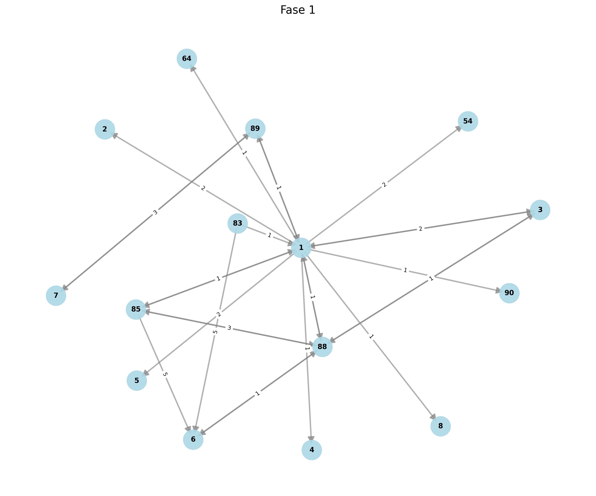

### Grafo co-citación , Fase 2

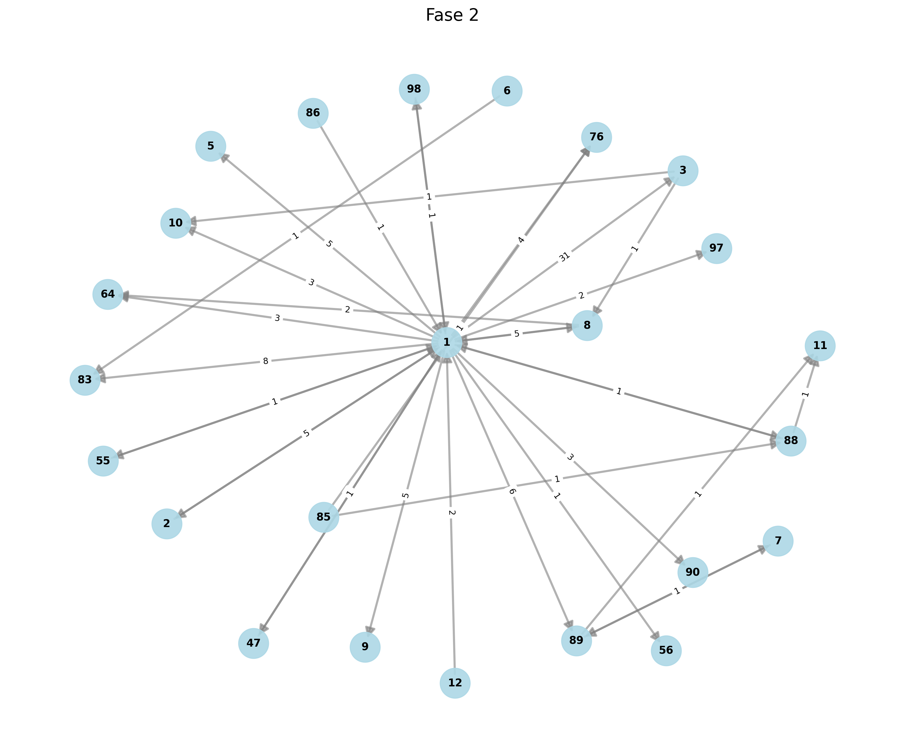

### Grafo co-citación , Fase 3

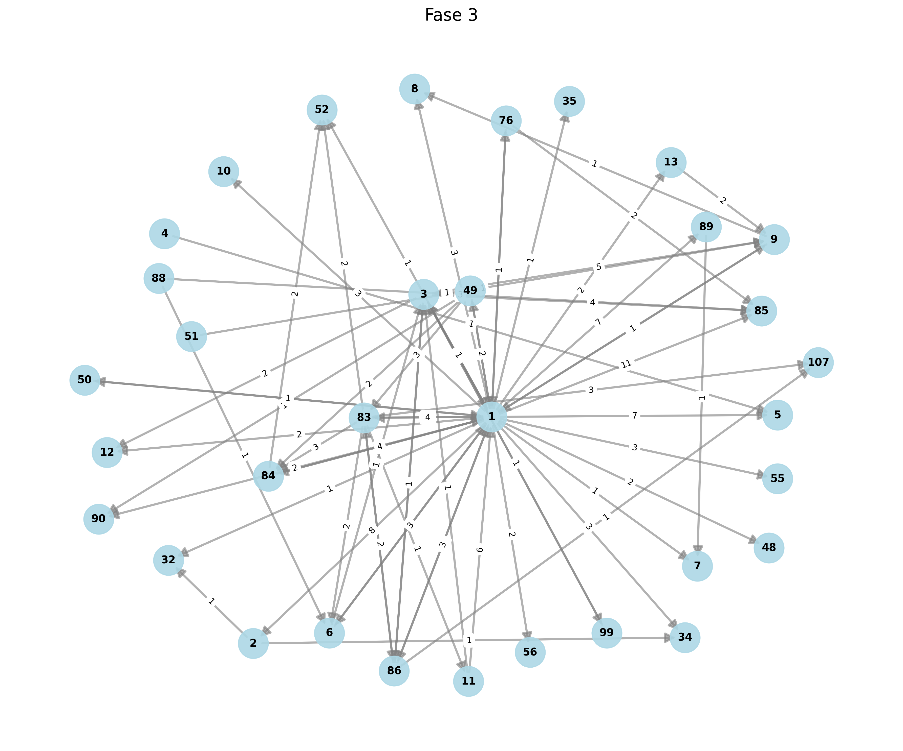

### Grafo co-citación , Fase 4

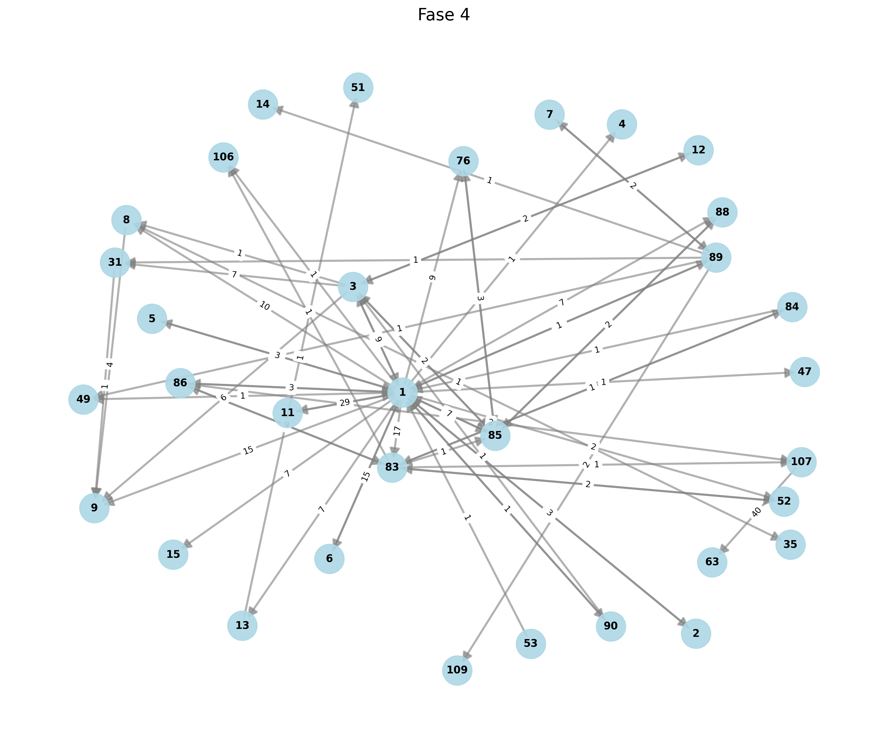

### Grafo co-citación , Fase 5

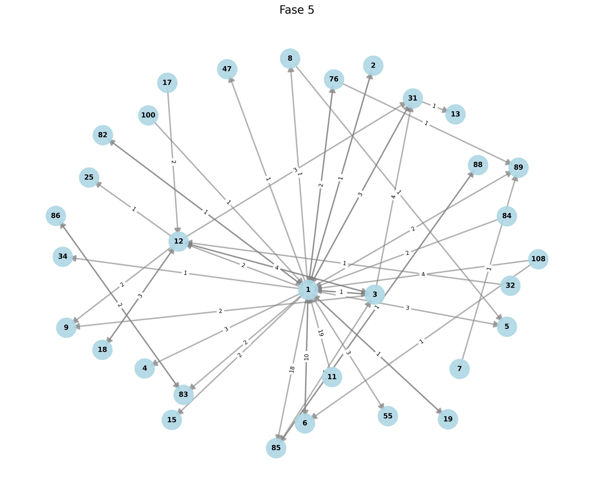

### Grafo co-citación , Fase 6

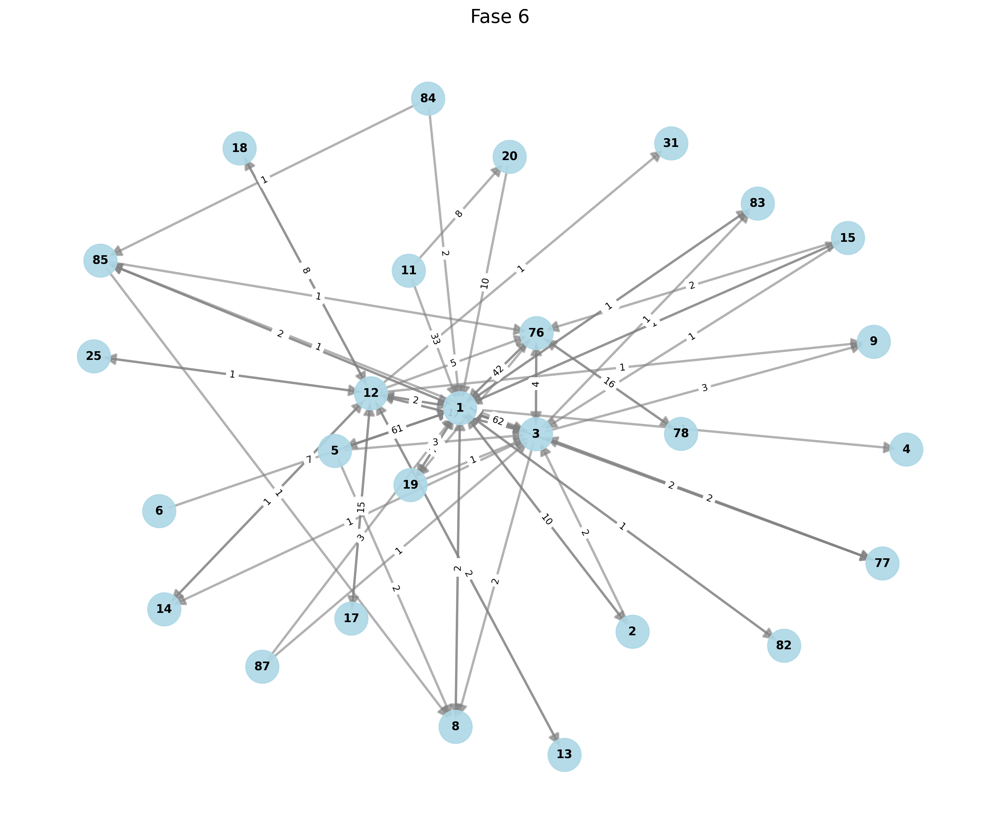

### Grafo co-citación , Fase 7

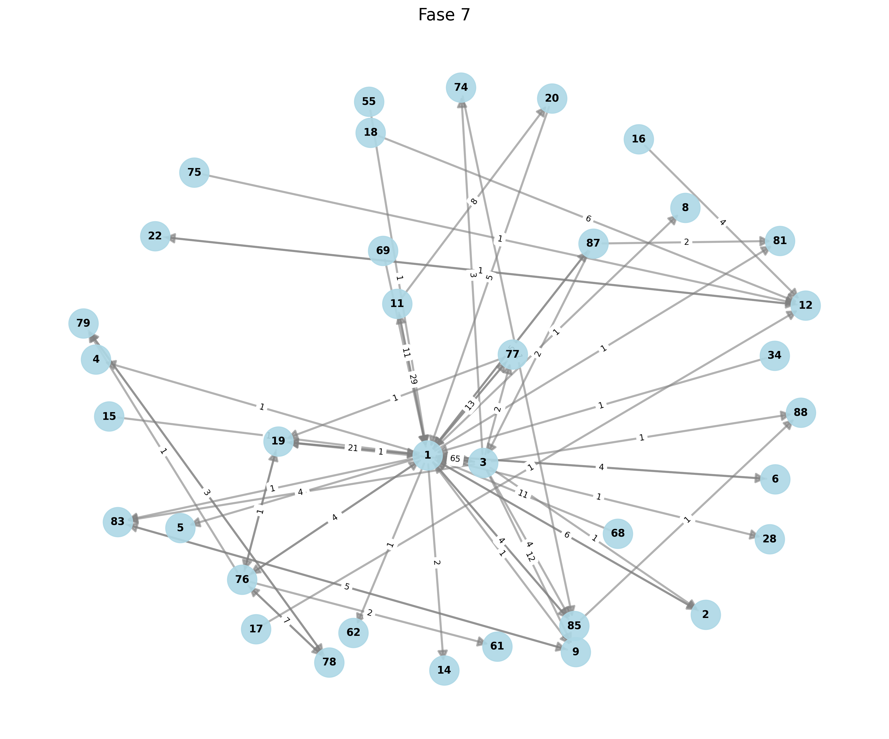

### Grafo co-citación , Fase 8

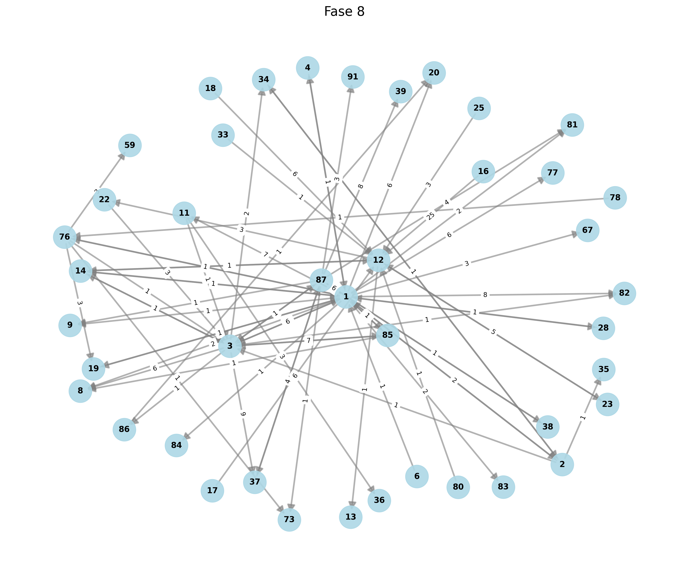

### Grafo co-citación , Fase 9

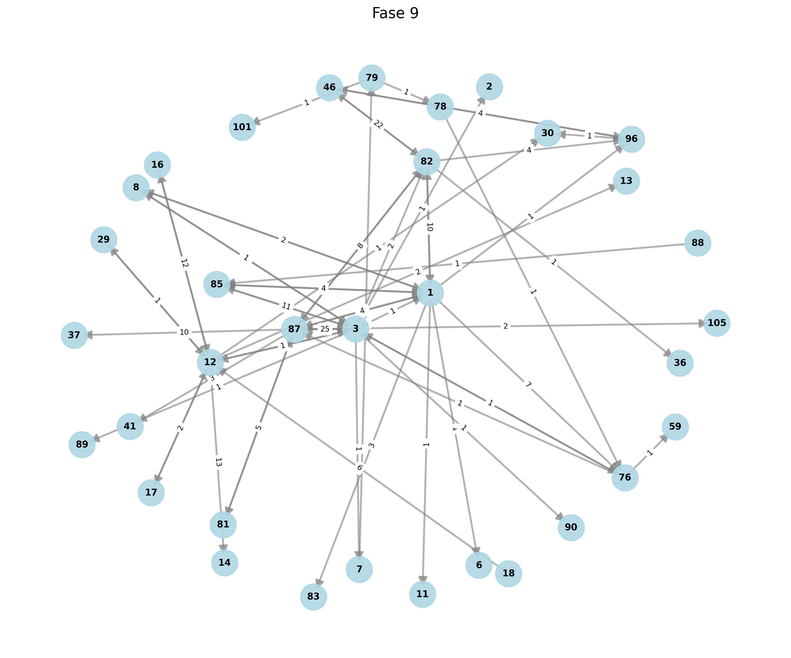

### Grafo co-citación , Fase 10

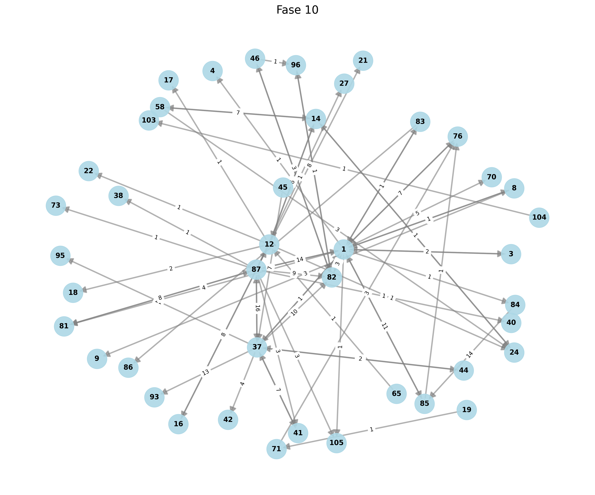

### Grafo co-citación , Fase 11

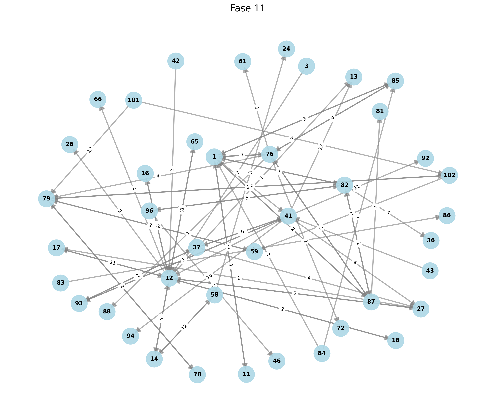

## Calculo de Métricas por fase

### Fase 1

| Libro | Libro_base_conexiones | Libro_importante_pesos_totales | Centralidad_grado | Grado_centralidad_normalizado | Intermediacion_normalizada | Fase |
| --- | --- | --- | --- | --- | --- | --- |
| 1 | 11 | 29 | 21 | 0.7857 | 0.028971 | 1 |
| 85 | 3 | 8 | 36 | 0.2143 | 0.029304 | 1 |
| 88 | 4 | 6 | 41 | 0.2857 | 0.016484 | 1 |
| 83 | 2 | 6 | 30 | 0.1429 | 0.032967 | 1 |
| 89 | 2 | 4 | 31 | 0.1429 | 0.021978 | 1 |
| 3 | 2 | 3 | 35 | 0.1429 | 0.016484 | 1 |
| 7 | 1 | 2 | 4 | 0.0714 | 0.021978 | 1 |
| 6 | 1 | 1 | 6 | 0.0714 | 0.010989 | 1 |
| 4 | 0 | 0 | 0 | 0.0 | 0.0 | 1 |
| 5 | 0 | 0 | 0 | 0.0 | 0.0 | 1 |
| 90 | 0 | 0 | 0 | 0.0 | 0.0 | 1 |
| 2 | 0 | 0 | 0 | 0.0 | 0.0 | 1 |
| 54 | 0 | 0 | 0 | 0.0 | 0.0 | 1 |
| 64 | 0 | 0 | 0 | 0.0 | 0.0 | 1 |
| 8 | 0 | 0 | 0 | 0.0 | 0.0 | 1 |

### Fase 2 

| Libro | Libro_base_conexiones | Libro_importante_pesos_totales | Centralidad_grado | Grado_centralidad_normalizado | Intermediacion_normalizada | Fase |
| --- | --- | --- | --- | --- | --- | --- |
| 1 | 17 | 92 | 21 | 0.7391 | 0.02139 | 2 |
| 8 | 2 | 7 | 92 | 0.087 | 0.013834 | 2 |
| 2 | 1 | 5 | 92 | 0.0435 | 0.019763 | 2 |
| 88 | 2 | 2 | 92 | 0.087 | 0.003953 | 2 |
| 12 | 1 | 2 | 92 | 0.0435 | 0.007905 | 2 |
| 3 | 2 | 2 | 7 | 0.087 | 0.003953 | 2 |
| 85 | 2 | 2 | 2 | 0.087 | 0.003953 | 2 |
| 89 | 2 | 2 | 1 | 0.087 | 0.003953 | 2 |
| 86 | 1 | 1 | 92 | 0.0435 | 0.003953 | 2 |
| 55 | 1 | 1 | 92 | 0.0435 | 0.003953 | 2 |
| 47 | 1 | 1 | 92 | 0.0435 | 0.003953 | 2 |
| 98 | 1 | 1 | 92 | 0.0435 | 0.003953 | 2 |
| 7 | 1 | 1 | 2 | 0.0435 | 0.003953 | 2 |
| 6 | 1 | 1 | 0 | 0.0435 | 0.003953 | 2 |
| 83 | 0 | 0 | 0 | 0.0 | 0.0 | 2 |
| 5 | 0 | 0 | 0 | 0.0 | 0.0 | 2 |
| 90 | 0 | 0 | 0 | 0.0 | 0.0 | 2 |
| 64 | 0 | 0 | 0 | 0.0 | 0.0 | 2 |
| 10 | 0 | 0 | 0 | 0.0 | 0.0 | 2 |
| 56 | 0 | 0 | 0 | 0.0 | 0.0 | 2 |
| 97 | 0 | 0 | 0 | 0.0 | 0.0 | 2 |
| 76 | 0 | 0 | 0 | 0.0 | 0.0 | 2 |
| 9 | 0 | 0 | 0 | 0.0 | 0.0 | 2 |
| 11 | 0 | 0 | 0 | 0.0 | 0.0 | 2 |

### Fase 3
 
| Libro | Libro_base_conexiones | Libro_importante_pesos_totales | Centralidad_grado | Grado_centralidad_normalizado | Intermediacion_normalizada | Fase |
| --- | --- | --- | --- | --- | --- | --- |
| 1 | 26 | 191 | 77 | 0.8125 | 0.014811 | 3 |
| 83 | 7 | 24 | 215 | 0.2188 | 0.006912 | 3 |
| 3 | 6 | 16 | 201 | 0.1875 | 0.005376 | 3 |
| 49 | 5 | 9 | 237 | 0.1562 | 0.003629 | 3 |
| 86 | 4 | 7 | 231 | 0.125 | 0.003528 | 3 |
| 11 | 2 | 7 | 207 | 0.0625 | 0.007056 | 3 |
| 84 | 2 | 6 | 191 | 0.0625 | 0.006048 | 3 |
| 6 | 2 | 4 | 207 | 0.0625 | 0.004032 | 3 |
| 88 | 2 | 4 | 4 | 0.0625 | 0.004032 | 3 |
| 76 | 2 | 3 | 191 | 0.0625 | 0.003024 | 3 |
| 9 | 2 | 2 | 191 | 0.0625 | 0.002016 | 3 |
| 13 | 1 | 2 | 2 | 0.0312 | 0.004032 | 3 |
| 2 | 2 | 2 | 0 | 0.0625 | 0.002016 | 3 |
| 50 | 1 | 1 | 191 | 0.0312 | 0.002016 | 3 |
| 99 | 1 | 1 | 16 | 0.0312 | 0.002016 | 3 |
| 51 | 1 | 1 | 2 | 0.0312 | 0.002016 | 3 |
| 4 | 1 | 1 | 0 | 0.0312 | 0.002016 | 3 |
| 89 | 1 | 1 | 0 | 0.0312 | 0.002016 | 3 |
| 5 | 0 | 0 | 0 | 0.0 | 0.0 | 3 |
| 48 | 0 | 0 | 0 | 0.0 | 0.0 | 3 |
| 85 | 0 | 0 | 0 | 0.0 | 0.0 | 3 |
| 90 | 0 | 0 | 0 | 0.0 | 0.0 | 3 |
| 7 | 0 | 0 | 0 | 0.0 | 0.0 | 3 |
| 8 | 0 | 0 | 0 | 0.0 | 0.0 | 3 |
| 55 | 0 | 0 | 0 | 0.0 | 0.0 | 3 |
| 10 | 0 | 0 | 0 | 0.0 | 0.0 | 3 |
| 56 | 0 | 0 | 0 | 0.0 | 0.0 | 3 |
| 34 | 0 | 0 | 0 | 0.0 | 0.0 | 3 |
| 35 | 0 | 0 | 0 | 0.0 | 0.0 | 3 |
| 32 | 0 | 0 | 0 | 0.0 | 0.0 | 3 |
| 107 | 0 | 0 | 0 | 0.0 | 0.0 | 3 |
| 12 | 0 | 0 | 0 | 0.0 | 0.0 | 3 |
| 52 | 0 | 0 | 0 | 0.0 | 0.0 | 3 |

### Fase 4
 
| Libro | Libro_base_conexiones | Libro_importante_pesos_totales | Centralidad_grado | Grado_centralidad_normalizado | Intermediacion_normalizada | Fase |
| --- | --- | --- | --- | --- | --- | --- |
| 1 | 21 | 256 | 152 | 0.6562 | 0.024578 | 4 |
| 107 | 1 | 40 | 0 | 0.0312 | 0.080645 | 4 |
| 11 | 1 | 29 | 256 | 0.0312 | 0.058468 | 4 |
| 3 | 6 | 28 | 281 | 0.1875 | 0.009409 | 4 |
| 85 | 4 | 18 | 292 | 0.125 | 0.009073 | 4 |
| 6 | 1 | 15 | 256 | 0.0312 | 0.030242 | 4 |
| 86 | 3 | 14 | 310 | 0.0938 | 0.009409 | 4 |
| 83 | 6 | 14 | 78 | 0.1875 | 0.004704 | 4 |
| 89 | 6 | 8 | 260 | 0.1875 | 0.002688 | 4 |
| 76 | 1 | 6 | 18 | 0.0312 | 0.012097 | 4 |
| 8 | 2 | 5 | 0 | 0.0625 | 0.00504 | 4 |
| 52 | 1 | 4 | 14 | 0.0312 | 0.008065 | 4 |
| 5 | 1 | 3 | 256 | 0.0312 | 0.006048 | 4 |
| 2 | 1 | 3 | 256 | 0.0312 | 0.006048 | 4 |
| 7 | 1 | 3 | 8 | 0.0312 | 0.006048 | 4 |
| 90 | 2 | 2 | 284 | 0.0625 | 0.002016 | 4 |
| 84 | 2 | 2 | 270 | 0.0625 | 0.002016 | 4 |
| 88 | 1 | 2 | 18 | 0.0312 | 0.004032 | 4 |
| 53 | 1 | 1 | 256 | 0.0312 | 0.002016 | 4 |
| 12 | 1 | 1 | 28 | 0.0312 | 0.002016 | 4 |
| 13 | 1 | 1 | 0 | 0.0312 | 0.002016 | 4 |
| 31 | 1 | 1 | 0 | 0.0312 | 0.002016 | 4 |
| 4 | 0 | 0 | 0 | 0.0 | 0.0 | 4 |
| 47 | 0 | 0 | 0 | 0.0 | 0.0 | 4 |
| 9 | 0 | 0 | 0 | 0.0 | 0.0 | 4 |
| 35 | 0 | 0 | 0 | 0.0 | 0.0 | 4 |
| 49 | 0 | 0 | 0 | 0.0 | 0.0 | 4 |
| 51 | 0 | 0 | 0 | 0.0 | 0.0 | 4 |
| 63 | 0 | 0 | 0 | 0.0 | 0.0 | 4 |
| 109 | 0 | 0 | 0 | 0.0 | 0.0 | 4 |
| 14 | 0 | 0 | 0 | 0.0 | 0.0 | 4 |
| 106 | 0 | 0 | 0 | 0.0 | 0.0 | 4 |
| 15 | 0 | 0 | 0 | 0.0 | 0.0 | 4 |

### Fase 5
 
| Libro | Libro_base_conexiones | Libro_importante_pesos_totales | Centralidad_grado | Grado_centralidad_normalizado | Intermediacion_normalizada | Fase |
| --- | --- | --- | --- | --- | --- | --- |
| 1 | 18 | 80 | 45 | 0.5806 | 0.009558 | 5 |
| 11 | 1 | 19 | 80 | 0.0323 | 0.04086 | 5 |
| 3 | 4 | 11 | 92 | 0.129 | 0.005914 | 5 |
| 6 | 1 | 10 | 80 | 0.0323 | 0.021505 | 5 |
| 12 | 5 | 8 | 18 | 0.1613 | 0.003441 | 5 |
| 108 | 2 | 5 | 90 | 0.0645 | 0.005376 | 5 |
| 31 | 2 | 4 | 80 | 0.0645 | 0.004301 | 5 |
| 76 | 2 | 3 | 80 | 0.0645 | 0.003226 | 5 |
| 85 | 2 | 3 | 12 | 0.0645 | 0.003226 | 5 |
| 18 | 1 | 3 | 8 | 0.0323 | 0.006452 | 5 |
| 84 | 1 | 2 | 80 | 0.0323 | 0.004301 | 5 |
| 17 | 1 | 2 | 8 | 0.0323 | 0.004301 | 5 |
| 83 | 1 | 2 | 2 | 0.0323 | 0.004301 | 5 |
| 86 | 1 | 2 | 2 | 0.0323 | 0.004301 | 5 |
| 2 | 1 | 1 | 80 | 0.0323 | 0.002151 | 5 |
| 100 | 1 | 1 | 80 | 0.0323 | 0.002151 | 5 |
| 82 | 1 | 1 | 80 | 0.0323 | 0.002151 | 5 |
| 19 | 1 | 1 | 80 | 0.0323 | 0.002151 | 5 |
| 32 | 1 | 1 | 8 | 0.0323 | 0.002151 | 5 |
| 88 | 1 | 1 | 3 | 0.0323 | 0.002151 | 5 |
| 7 | 1 | 1 | 0 | 0.0323 | 0.002151 | 5 |
| 8 | 1 | 1 | 0 | 0.0323 | 0.002151 | 5 |
| 4 | 0 | 0 | 0 | 0.0 | 0.0 | 5 |
| 89 | 0 | 0 | 0 | 0.0 | 0.0 | 5 |
| 5 | 0 | 0 | 0 | 0.0 | 0.0 | 5 |
| 55 | 0 | 0 | 0 | 0.0 | 0.0 | 5 |
| 47 | 0 | 0 | 0 | 0.0 | 0.0 | 5 |
| 9 | 0 | 0 | 0 | 0.0 | 0.0 | 5 |
| 34 | 0 | 0 | 0 | 0.0 | 0.0 | 5 |
| 13 | 0 | 0 | 0 | 0.0 | 0.0 | 5 |
| 25 | 0 | 0 | 0 | 0.0 | 0.0 | 5 |
| 15 | 0 | 0 | 0 | 0.0 | 0.0 | 5 |

### Fase 6
 
| Libro | Libro_base_conexiones | Libro_importante_pesos_totales | Centralidad_grado | Grado_centralidad_normalizado | Intermediacion_normalizada | Fase |
| --- | --- | --- | --- | --- | --- | --- |
| 1 | 13 | 137 | 423 | 0.5 | 0.032426 | 6 |
| 12 | 10 | 107 | 310 | 0.3846 | 0.032923 | 6 |
| 3 | 9 | 96 | 306 | 0.3462 | 0.032821 | 6 |
| 19 | 2 | 76 | 233 | 0.0769 | 0.116923 | 6 |
| 5 | 3 | 66 | 235 | 0.1154 | 0.067692 | 6 |
| 76 | 4 | 50 | 325 | 0.1538 | 0.038462 | 6 |
| 11 | 2 | 41 | 147 | 0.0769 | 0.063077 | 6 |
| 78 | 1 | 16 | 50 | 0.0385 | 0.049231 | 6 |
| 17 | 1 | 15 | 107 | 0.0385 | 0.046154 | 6 |
| 2 | 2 | 12 | 233 | 0.0769 | 0.018462 | 6 |
| 20 | 1 | 10 | 137 | 0.0385 | 0.030769 | 6 |
| 18 | 1 | 8 | 107 | 0.0385 | 0.024615 | 6 |
| 6 | 1 | 7 | 137 | 0.0385 | 0.021538 | 6 |
| 15 | 3 | 4 | 283 | 0.1154 | 0.004103 | 6 |
| 77 | 2 | 4 | 233 | 0.0769 | 0.006154 | 6 |
| 87 | 2 | 4 | 233 | 0.0769 | 0.006154 | 6 |
| 85 | 3 | 4 | 189 | 0.1154 | 0.004103 | 6 |
| 84 | 2 | 3 | 141 | 0.0769 | 0.004615 | 6 |
| 8 | 1 | 2 | 137 | 0.0385 | 0.006154 | 6 |
| 13 | 1 | 2 | 107 | 0.0385 | 0.006154 | 6 |
| 83 | 1 | 1 | 137 | 0.0385 | 0.003077 | 6 |
| 82 | 1 | 1 | 137 | 0.0385 | 0.003077 | 6 |
| 14 | 1 | 1 | 107 | 0.0385 | 0.003077 | 6 |
| 25 | 1 | 1 | 107 | 0.0385 | 0.003077 | 6 |
| 4 | 0 | 0 | 0 | 0.0 | 0.0 | 6 |
| 9 | 0 | 0 | 0 | 0.0 | 0.0 | 6 |
| 31 | 0 | 0 | 0 | 0.0 | 0.0 | 6 |

### Fase 7
 
| Libro | Libro_base_conexiones | Libro_importante_pesos_totales | Centralidad_grado | Grado_centralidad_normalizado | Intermediacion_normalizada | Fase |
| --- | --- | --- | --- | --- | --- | --- |
| 1 | 18 | 100 | 223 | 0.5143 | 0.009337 | 7 |
| 3 | 9 | 93 | 154 | 0.2571 | 0.017367 | 7 |
| 11 | 2 | 37 | 105 | 0.0571 | 0.031092 | 7 |
| 19 | 2 | 22 | 117 | 0.0571 | 0.018487 | 7 |
| 87 | 3 | 19 | 193 | 0.0857 | 0.010644 | 7 |
| 76 | 5 | 17 | 133 | 0.1429 | 0.005714 | 7 |
| 77 | 2 | 14 | 122 | 0.0571 | 0.011765 | 7 |
| 69 | 1 | 11 | 100 | 0.0286 | 0.018487 | 7 |
| 68 | 1 | 11 | 100 | 0.0286 | 0.018487 | 7 |
| 78 | 2 | 8 | 20 | 0.0571 | 0.006723 | 7 |
| 2 | 1 | 6 | 100 | 0.0286 | 0.010084 | 7 |
| 18 | 1 | 6 | 1 | 0.0286 | 0.010084 | 7 |
| 85 | 2 | 5 | 100 | 0.0571 | 0.004202 | 7 |
| 20 | 1 | 5 | 100 | 0.0286 | 0.008403 | 7 |
| 9 | 1 | 5 | 1 | 0.0286 | 0.008403 | 7 |
| 6 | 1 | 4 | 100 | 0.0286 | 0.006723 | 7 |
| 16 | 1 | 4 | 1 | 0.0286 | 0.006723 | 7 |
| 79 | 1 | 3 | 8 | 0.0286 | 0.005042 | 7 |
| 55 | 1 | 1 | 100 | 0.0286 | 0.001681 | 7 |
| 34 | 1 | 1 | 100 | 0.0286 | 0.001681 | 7 |
| 15 | 1 | 1 | 100 | 0.0286 | 0.001681 | 7 |
| 83 | 1 | 1 | 5 | 0.0286 | 0.001681 | 7 |
| 74 | 1 | 1 | 5 | 0.0286 | 0.001681 | 7 |
| 12 | 1 | 1 | 1 | 0.0286 | 0.001681 | 7 |
| 17 | 1 | 1 | 1 | 0.0286 | 0.001681 | 7 |
| 22 | 1 | 1 | 1 | 0.0286 | 0.001681 | 7 |
| 75 | 1 | 1 | 1 | 0.0286 | 0.001681 | 7 |
| 4 | 0 | 0 | 0 | 0.0 | 0.0 | 7 |
| 5 | 0 | 0 | 0 | 0.0 | 0.0 | 7 |
| 88 | 0 | 0 | 0 | 0.0 | 0.0 | 7 |
| 62 | 0 | 0 | 0 | 0.0 | 0.0 | 7 |
| 8 | 0 | 0 | 0 | 0.0 | 0.0 | 7 |
| 14 | 0 | 0 | 0 | 0.0 | 0.0 | 7 |
| 61 | 0 | 0 | 0 | 0.0 | 0.0 | 7 |
| 28 | 0 | 0 | 0 | 0.0 | 0.0 | 7 |
| 81 | 0 | 0 | 0 | 0.0 | 0.0 | 7 |

### Fase 8 

| Libro | Libro_base_conexiones | Libro_importante_pesos_totales | Centralidad_grado | Grado_centralidad_normalizado | Intermediacion_normalizada | Fase |
| --- | --- | --- | --- | --- | --- | --- |
| 1 | 19 | 162 | 95 | 0.4634 | 0.010398 | 8 |
| 3 | 9 | 33 | 207 | 0.2195 | 0.004472 | 8 |
| 87 | 9 | 29 | 198 | 0.2195 | 0.00393 | 8 |
| 16 | 1 | 25 | 21 | 0.0244 | 0.030488 | 8 |
| 12 | 4 | 21 | 11 | 0.0976 | 0.006402 | 8 |
| 76 | 5 | 9 | 196 | 0.122 | 0.002195 | 8 |
| 85 | 3 | 9 | 195 | 0.0732 | 0.003659 | 8 |
| 18 | 1 | 6 | 21 | 0.0244 | 0.007317 | 8 |
| 17 | 1 | 6 | 21 | 0.0244 | 0.007317 | 8 |
| 2 | 4 | 5 | 196 | 0.0976 | 0.001524 | 8 |
| 23 | 1 | 5 | 21 | 0.0244 | 0.006098 | 8 |
| 11 | 2 | 4 | 33 | 0.0488 | 0.002439 | 8 |
| 14 | 3 | 3 | 216 | 0.0732 | 0.00122 | 8 |
| 22 | 1 | 3 | 33 | 0.0244 | 0.003659 | 8 |
| 25 | 1 | 3 | 21 | 0.0244 | 0.003659 | 8 |
| 37 | 1 | 2 | 29 | 0.0244 | 0.002439 | 8 |
| 4 | 1 | 1 | 162 | 0.0244 | 0.00122 | 8 |
| 6 | 1 | 1 | 162 | 0.0244 | 0.00122 | 8 |
| 19 | 1 | 1 | 162 | 0.0244 | 0.00122 | 8 |
| 28 | 1 | 1 | 162 | 0.0244 | 0.00122 | 8 |
| 38 | 1 | 1 | 29 | 0.0244 | 0.00122 | 8 |
| 33 | 1 | 1 | 21 | 0.0244 | 0.00122 | 8 |
| 80 | 1 | 1 | 21 | 0.0244 | 0.00122 | 8 |
| 78 | 1 | 1 | 9 | 0.0244 | 0.00122 | 8 |
| 34 | 1 | 1 | 5 | 0.0244 | 0.00122 | 8 |
| 86 | 1 | 1 | 0 | 0.0244 | 0.00122 | 8 |
| 83 | 0 | 0 | 0 | 0.0 | 0.0 | 8 |
| 8 | 0 | 0 | 0 | 0.0 | 0.0 | 8 |
| 9 | 0 | 0 | 0 | 0.0 | 0.0 | 8 |
| 35 | 0 | 0 | 0 | 0.0 | 0.0 | 8 |
| 84 | 0 | 0 | 0 | 0.0 | 0.0 | 8 |
| 13 | 0 | 0 | 0 | 0.0 | 0.0 | 8 |
| 82 | 0 | 0 | 0 | 0.0 | 0.0 | 8 |
| 77 | 0 | 0 | 0 | 0.0 | 0.0 | 8 |
| 20 | 0 | 0 | 0 | 0.0 | 0.0 | 8 |
| 81 | 0 | 0 | 0 | 0.0 | 0.0 | 8 |
| 67 | 0 | 0 | 0 | 0.0 | 0.0 | 8 |
| 73 | 0 | 0 | 0 | 0.0 | 0.0 | 8 |
| 39 | 0 | 0 | 0 | 0.0 | 0.0 | 8 |
| 59 | 0 | 0 | 0 | 0.0 | 0.0 | 8 |
| 91 | 0 | 0 | 0 | 0.0 | 0.0 | 8 |
| 36 | 0 | 0 | 0 | 0.0 | 0.0 | 8 |

### Fase 9 

| Libro | Libro_base_conexiones | Libro_importante_pesos_totales | Centralidad_grado | Grado_centralidad_normalizado | Intermediacion_normalizada | Fase |
| --- | --- | --- | --- | --- | --- | --- |
| 1 | 9 | 74 | 121 | 0.2727 | 0.015572 | 9 |
| 87 | 7 | 57 | 163 | 0.2121 | 0.015422 | 9 |
| 3 | 11 | 50 | 227 | 0.3333 | 0.008609 | 9 |
| 82 | 5 | 38 | 145 | 0.1515 | 0.014394 | 9 |
| 12 | 7 | 36 | 65 | 0.2121 | 0.00974 | 9 |
| 85 | 2 | 15 | 124 | 0.0606 | 0.014205 | 9 |
| 16 | 1 | 12 | 36 | 0.0303 | 0.022727 | 9 |
| 46 | 2 | 9 | 43 | 0.0606 | 0.008523 | 9 |
| 18 | 1 | 6 | 36 | 0.0303 | 0.011364 | 9 |
| 96 | 2 | 5 | 9 | 0.0606 | 0.004735 | 9 |
| 8 | 2 | 3 | 124 | 0.0606 | 0.002841 | 9 |
| 76 | 3 | 3 | 107 | 0.0909 | 0.001894 | 9 |
| 17 | 1 | 2 | 36 | 0.0303 | 0.003788 | 9 |
| 79 | 2 | 2 | 1 | 0.0606 | 0.001894 | 9 |
| 81 | 1 | 1 | 57 | 0.0303 | 0.001894 | 9 |
| 29 | 1 | 1 | 36 | 0.0303 | 0.001894 | 9 |
| 88 | 1 | 1 | 15 | 0.0303 | 0.001894 | 9 |
| 78 | 1 | 1 | 3 | 0.0303 | 0.001894 | 9 |
| 7 | 1 | 1 | 2 | 0.0303 | 0.001894 | 9 |
| 89 | 0 | 0 | 0 | 0.0 | 0.0 | 9 |
| 83 | 0 | 0 | 0 | 0.0 | 0.0 | 9 |
| 90 | 0 | 0 | 0 | 0.0 | 0.0 | 9 |
| 2 | 0 | 0 | 0 | 0.0 | 0.0 | 9 |
| 6 | 0 | 0 | 0 | 0.0 | 0.0 | 9 |
| 11 | 0 | 0 | 0 | 0.0 | 0.0 | 9 |
| 13 | 0 | 0 | 0 | 0.0 | 0.0 | 9 |
| 14 | 0 | 0 | 0 | 0.0 | 0.0 | 9 |
| 59 | 0 | 0 | 0 | 0.0 | 0.0 | 9 |
| 37 | 0 | 0 | 0 | 0.0 | 0.0 | 9 |
| 36 | 0 | 0 | 0 | 0.0 | 0.0 | 9 |
| 30 | 0 | 0 | 0 | 0.0 | 0.0 | 9 |
| 105 | 0 | 0 | 0 | 0.0 | 0.0 | 9 |
| 101 | 0 | 0 | 0 | 0.0 | 0.0 | 9 |
| 41 | 0 | 0 | 0 | 0.0 | 0.0 | 9 |

### fase 10
 
| Libro | Libro_base_conexiones | Libro_importante_pesos_totales | Centralidad_grado | Grado_centralidad_normalizado | Intermediacion_normalizada | Fase |
| --- | --- | --- | --- | --- | --- | --- |
| 37 | 8 | 109 | 164 | 0.1951 | 0.016616 | 10 |
| 12 | 6 | 96 | 38 | 0.1463 | 0.019512 | 10 |
| 1 | 13 | 78 | 231 | 0.3171 | 0.007317 | 10 |
| 87 | 11 | 65 | 207 | 0.2683 | 0.007206 | 10 |
| 14 | 3 | 29 | 107 | 0.0732 | 0.011789 | 10 |
| 84 | 1 | 14 | 12 | 0.0244 | 0.017073 | 10 |
| 85 | 2 | 12 | 85 | 0.0488 | 0.007317 | 10 |
| 82 | 3 | 12 | 81 | 0.0732 | 0.004878 | 10 |
| 58 | 2 | 10 | 30 | 0.0488 | 0.006098 | 10 |
| 16 | 1 | 8 | 96 | 0.0244 | 0.009756 | 10 |
| 41 | 1 | 7 | 109 | 0.0244 | 0.008537 | 10 |
| 45 | 1 | 7 | 109 | 0.0244 | 0.008537 | 10 |
| 76 | 1 | 7 | 78 | 0.0244 | 0.008537 | 10 |
| 83 | 2 | 5 | 78 | 0.0488 | 0.003049 | 10 |
| 8 | 2 | 4 | 78 | 0.0488 | 0.002439 | 10 |
| 71 | 1 | 3 | 7 | 0.0244 | 0.003659 | 10 |
| 44 | 1 | 2 | 109 | 0.0244 | 0.002439 | 10 |
| 3 | 1 | 2 | 78 | 0.0244 | 0.002439 | 10 |
| 46 | 2 | 2 | 13 | 0.0488 | 0.00122 | 10 |
| 65 | 1 | 1 | 96 | 0.0244 | 0.00122 | 10 |
| 81 | 1 | 1 | 65 | 0.0244 | 0.00122 | 10 |
| 24 | 1 | 1 | 29 | 0.0244 | 0.00122 | 10 |
| 96 | 1 | 1 | 12 | 0.0244 | 0.00122 | 10 |
| 19 | 1 | 1 | 3 | 0.0244 | 0.00122 | 10 |
| 104 | 1 | 1 | 0 | 0.0244 | 0.00122 | 10 |
| 4 | 0 | 0 | 0 | 0.0 | 0.0 | 10 |
| 86 | 0 | 0 | 0 | 0.0 | 0.0 | 10 |
| 9 | 0 | 0 | 0 | 0.0 | 0.0 | 10 |
| 18 | 0 | 0 | 0 | 0.0 | 0.0 | 10 |
| 17 | 0 | 0 | 0 | 0.0 | 0.0 | 10 |
| 22 | 0 | 0 | 0 | 0.0 | 0.0 | 10 |
| 38 | 0 | 0 | 0 | 0.0 | 0.0 | 10 |
| 73 | 0 | 0 | 0 | 0.0 | 0.0 | 10 |
| 105 | 0 | 0 | 0 | 0.0 | 0.0 | 10 |
| 21 | 0 | 0 | 0 | 0.0 | 0.0 | 10 |
| 103 | 0 | 0 | 0 | 0.0 | 0.0 | 10 |
| 27 | 0 | 0 | 0 | 0.0 | 0.0 | 10 |
| 95 | 0 | 0 | 0 | 0.0 | 0.0 | 10 |
| 93 | 0 | 0 | 0 | 0.0 | 0.0 | 10 |
| 42 | 0 | 0 | 0 | 0.0 | 0.0 | 10 |
| 40 | 0 | 0 | 0 | 0.0 | 0.0 | 10 |
| 70 | 0 | 0 | 0 | 0.0 | 0.0 | 10 |

### Fase 11
 
| Libro | Libro_base_conexiones | Libro_importante_pesos_totales | Centralidad_grado | Grado_centralidad_normalizado | Intermediacion_normalizada | Fase |
| --- | --- | --- | --- | --- | --- | --- |
| 12 | 9 | 49 | 76 | 0.225 | 0.00698 | 11 |
| 41 | 7 | 48 | 96 | 0.175 | 0.008791 | 11 |
| 37 | 3 | 42 | 53 | 0.075 | 0.017949 | 11 |
| 16 | 1 | 33 | 49 | 0.025 | 0.042308 | 11 |
| 76 | 7 | 25 | 41 | 0.175 | 0.004579 | 11 |
| 1 | 6 | 22 | 101 | 0.15 | 0.004701 | 11 |
| 65 | 1 | 18 | 49 | 0.025 | 0.023077 | 11 |
| 58 | 2 | 15 | 9 | 0.05 | 0.009615 | 11 |
| 101 | 2 | 15 | 8 | 0.05 | 0.009615 | 11 |
| 82 | 4 | 13 | 36 | 0.1 | 0.004167 | 11 |
| 17 | 1 | 11 | 49 | 0.025 | 0.014103 | 11 |
| 14 | 2 | 9 | 64 | 0.05 | 0.005769 | 11 |
| 87 | 4 | 7 | 60 | 0.1 | 0.002244 | 11 |
| 85 | 2 | 7 | 47 | 0.05 | 0.004487 | 11 |
| 96 | 2 | 7 | 13 | 0.05 | 0.004487 | 11 |
| 59 | 1 | 6 | 5 | 0.025 | 0.007692 | 11 |
| 79 | 3 | 5 | 10 | 0.075 | 0.002137 | 11 |
| 27 | 2 | 3 | 60 | 0.05 | 0.001923 | 11 |
| 3 | 1 | 3 | 49 | 0.025 | 0.003846 | 11 |
| 102 | 2 | 3 | 11 | 0.05 | 0.001923 | 11 |
| 83 | 1 | 3 | 0 | 0.025 | 0.003846 | 11 |
| 93 | 2 | 2 | 90 | 0.05 | 0.001282 | 11 |
| 18 | 1 | 2 | 49 | 0.025 | 0.002564 | 11 |
| 42 | 1 | 2 | 49 | 0.025 | 0.002564 | 11 |
| 84 | 2 | 2 | 29 | 0.05 | 0.001282 | 11 |
| 43 | 1 | 1 | 48 | 0.025 | 0.001282 | 11 |
| 11 | 1 | 1 | 22 | 0.025 | 0.001282 | 11 |
| 78 | 1 | 1 | 5 | 0.025 | 0.001282 | 11 |
| 88 | 0 | 0 | 0 | 0.0 | 0.0 | 11 |
| 86 | 0 | 0 | 0 | 0.0 | 0.0 | 11 |
| 13 | 0 | 0 | 0 | 0.0 | 0.0 | 11 |
| 61 | 0 | 0 | 0 | 0.0 | 0.0 | 11 |
| 81 | 0 | 0 | 0 | 0.0 | 0.0 | 11 |
| 36 | 0 | 0 | 0 | 0.0 | 0.0 | 11 |
| 24 | 0 | 0 | 0 | 0.0 | 0.0 | 11 |
| 46 | 0 | 0 | 0 | 0.0 | 0.0 | 11 |
| 72 | 0 | 0 | 0 | 0.0 | 0.0 | 11 |
| 26 | 0 | 0 | 0 | 0.0 | 0.0 | 11 |
| 94 | 0 | 0 | 0 | 0.0 | 0.0 | 11 |
| 92 | 0 | 0 | 0 | 0.0 | 0.0 | 11 |
| 66 | 0 | 0 | 0 | 0.0 | 0.0 | 11 |

## Libro más importante en cada fase

Por cada fase, se identifica el libro con la mayor cantidad de conexiones hacia libros importantes, así como la suma total de conexiones hacia libros importantes en esa fase.
Se incluyen también las métricas de centralidad de grado e intermediación del libro más importante.
En la tabla siguiente se resumen estos datos, donde se interpreta de esta manera:
- Fase: Número de la fase.
- Libro_mas_importante: Identificador del libro con más conexiones hacia libros importantes en esa fase.
- Libro_importante: Cantidad total de conexiones hacia libros importantes en esa fase.
- Centralidad_grado: Métrica de centralidad de grado del libro más importante en esa fase.
- Intermediacion: Métrica de intermediación del libro más importante en esa fase.

Entonces, se puede interpretar de esta manera: (tomando de ejemplo fase 1)
Para la fase 1, el libro 1 es el más importante con 29 conexiones hacia libros importantes, tiene una centralidad de grado de 21.0 y una intermediación de aproximadamente 0.028971.

| Fase | Libro_mas_importante | Libro_importante | Centralidad_grado | Intermediacion |
| --- | --- | --- | --- | --- |
| 1 | 1 | 29.0 | 21.0 | 0.028971 |
| 2 | 1 | 92.0 | 21.0 | 0.02139 |
| 3 | 1 | 191.0 | 77.0 | 0.014811 |
| 4 | 1 | 256.0 | 152.0 | 0.024578 |
| 5 | 1 | 80.0 | 45.0 | 0.009558 |
| 6 | 1 | 137.0 | 423.0 | 0.032426 |
| 7 | 1 | 100.0 | 223.0 | 0.009337 |
| 8 | 1 | 162.0 | 95.0 | 0.010398 |
| 9 | 1 | 74.0 | 121.0 | 0.015572 |
| 10 | 37 | 109.0 | 164.0 | 0.016616 |
| 11 | 12 | 49.0 | 76.0 | 0.00698 |

## Análisis global a través de las fases

| Libro | Libro_base_conexiones | Libro_importante_pesos_totales | Centralidad_grado | Grado_centralidad_normalizado | Intermediacion_normalizada | Fase |
| --- | --- | --- | --- | --- | --- | --- |
| 1 | 15.545454545454545 | 111.0 | 137.27272727272728 | 0.5265090909090909 | 0.01627809090909091 | 6.0 |
| 37 | 3.0 | 38.25 | 61.5 | 0.073625 | 0.009250999999999999 | 9.5 |
| 12 | 4.4 | 32.1 | 63.9 | 0.13302 | 0.00906 | 6.5 |
| 3 | 5.454545454545454 | 30.636363636363637 | 148.8181818181818 | 0.17630909090909092 | 0.010062727272727272 | 6.0 |
| 87 | 6.0 | 30.166666666666668 | 175.66666666666666 | 0.16041666666666668 | 0.0076 | 8.5 |
| 19 | 1.4 | 20.2 | 119.0 | 0.043019999999999996 | 0.028000199999999996 | 7.2 |
| 107 | 0.5 | 20.0 | 0.0 | 0.0156 | 0.0403225 | 3.5 |
| 41 | 2.6666666666666665 | 18.333333333333332 | 68.33333333333333 | 0.06646666666666666 | 0.005776 | 10.0 |
| 16 | 1.0 | 16.4 | 40.6 | 0.02654 | 0.0224004 | 9.0 |
| 11 | 1.2222222222222223 | 15.333333333333334 | 94.44444444444444 | 0.037088888888888887 | 0.022697111111111112 | 6.111111111111111 |
| 58 | 2.0 | 12.5 | 19.5 | 0.0494 | 0.0078565 | 10.5 |
| 76 | 3.0 | 12.3 | 116.9 | 0.08671999999999999 | 0.0079728 | 6.5 |
| 68 | 1.0 | 11.0 | 100.0 | 0.0286 | 0.018487 | 7.0 |
| 69 | 1.0 | 11.0 | 100.0 | 0.0286 | 0.018487 | 7.0 |
| 82 | 2.3333333333333335 | 10.833333333333334 | 79.83333333333333 | 0.06591666666666667 | 0.004777833333333334 | 8.166666666666666 |
| 5 | 0.5714285714285714 | 9.857142857142858 | 70.14285714285714 | 0.020942857142857145 | 0.010534285714285715 | 4.0 |
| 65 | 1.0 | 9.5 | 72.5 | 0.0247 | 0.0121485 | 10.5 |
| 85 | 2.272727272727273 | 7.545454545454546 | 98.36363636363636 | 0.08144545454545454 | 0.007593545454545455 | 6.0 |
| 101 | 1.0 | 7.5 | 4.0 | 0.025 | 0.0048075 | 10.0 |
| 45 | 1.0 | 7.0 | 109.0 | 0.0244 | 0.008537 | 10.0 |
| 77 | 1.3333333333333333 | 6.0 | 118.33333333333333 | 0.04466666666666667 | 0.005972999999999999 | 7.0 |
| 14 | 1.2857142857142858 | 6.0 | 70.57142857142857 | 0.033557142857142855 | 0.003122142857142857 | 7.857142857142857 |
| 78 | 1.2 | 5.4 | 17.4 | 0.03506 | 0.012069999999999999 | 8.2 |
| 17 | 0.8571428571428571 | 5.285714285714286 | 31.714285714285715 | 0.025585714285714288 | 0.011049142857142856 | 8.0 |
| 83 | 1.9090909090909092 | 5.090909090909091 | 49.54545454545455 | 0.06567272727272727 | 0.005503363636363636 | 6.0 |
| 108 | 2.0 | 5.0 | 90.0 | 0.0645 | 0.005376 | 5.0 |
| 20 | 0.6666666666666666 | 5.0 | 79.0 | 0.022366666666666663 | 0.013057333333333332 | 7.0 |
| 23 | 1.0 | 5.0 | 21.0 | 0.0244 | 0.006098 | 8.0 |
| 6 | 1.0 | 4.777777777777778 | 105.33333333333333 | 0.03693333333333334 | 0.011133555555555556 | 5.0 |
| 49 | 2.5 | 4.5 | 118.5 | 0.0781 | 0.0018145 | 3.5 |
| 18 | 0.8571428571428571 | 4.428571428571429 | 31.714285714285715 | 0.025585714285714288 | 0.008913714285714285 | 8.0 |
| 96 | 1.6666666666666667 | 4.333333333333333 | 11.333333333333334 | 0.045000000000000005 | 0.0034806666666666666 | 10.0 |
| 84 | 1.4285714285714286 | 4.142857142857143 | 103.28571428571429 | 0.044085714285714284 | 0.005047857142857144 | 6.714285714285714 |
| 2 | 1.3333333333333333 | 3.7777777777777777 | 106.33333333333333 | 0.0414 | 0.006672 | 5.0 |
| 46 | 1.3333333333333333 | 3.6666666666666665 | 18.666666666666668 | 0.03646666666666667 | 0.0032476666666666665 | 10.0 |
| 86 | 1.4285714285714286 | 3.5714285714285716 | 90.71428571428571 | 0.045571428571428575 | 0.0032015714285714286 | 6.142857142857143 |
| 79 | 2.0 | 3.3333333333333335 | 6.333333333333333 | 0.054733333333333335 | 0.0030243333333333333 | 9.0 |
| 102 | 2.0 | 3.0 | 11.0 | 0.05 | 0.001923 | 11.0 |
| 71 | 1.0 | 3.0 | 7.0 | 0.0244 | 0.003659 | 10.0 |
| 89 | 1.8333333333333333 | 2.5 | 48.666666666666664 | 0.07476666666666666 | 0.005105833333333334 | 4.0 |
| 8 | 1.0 | 2.2 | 43.1 | 0.03297 | 0.0032459000000000003 | 5.5 |
| 44 | 1.0 | 2.0 | 109.0 | 0.0244 | 0.002439 | 10.0 |
| 88 | 1.375 | 2.0 | 21.625 | 0.066125 | 0.00406825 | 5.25 |
| 52 | 0.5 | 2.0 | 7.0 | 0.0156 | 0.0040325 | 3.5 |
| 59 | 0.3333333333333333 | 2.0 | 1.6666666666666667 | 0.008333333333333333 | 0.002564 | 9.333333333333334 |
| 31 | 1.0 | 1.6666666666666667 | 26.666666666666668 | 0.031900000000000005 | 0.0021056666666666667 | 5.0 |
| 27 | 1.0 | 1.5 | 30.0 | 0.025 | 0.0009615 | 10.5 |
| 25 | 0.6666666666666666 | 1.3333333333333333 | 42.666666666666664 | 0.020966666666666665 | 0.002245333333333333 | 6.333333333333333 |
| 22 | 0.6666666666666666 | 1.3333333333333333 | 11.333333333333334 | 0.017666666666666667 | 0.0017800000000000001 | 8.333333333333334 |
| 7 | 0.8333333333333334 | 1.3333333333333333 | 2.6666666666666665 | 0.03478333333333333 | 0.006004 | 4.0 |
| 15 | 1.0 | 1.25 | 95.75 | 0.036000000000000004 | 0.001446 | 5.5 |
| 53 | 1.0 | 1.0 | 256.0 | 0.0312 | 0.002016 | 4.0 |
| 50 | 1.0 | 1.0 | 191.0 | 0.0312 | 0.002016 | 3.0 |
| 98 | 1.0 | 1.0 | 92.0 | 0.0435 | 0.003953 | 2.0 |
| 100 | 1.0 | 1.0 | 80.0 | 0.0323 | 0.002151 | 5.0 |
| 43 | 1.0 | 1.0 | 48.0 | 0.025 | 0.001282 | 11.0 |
| 93 | 1.0 | 1.0 | 45.0 | 0.025 | 0.000641 | 10.5 |
| 29 | 1.0 | 1.0 | 36.0 | 0.0303 | 0.001894 | 9.0 |
| 42 | 0.5 | 1.0 | 24.5 | 0.0125 | 0.001282 | 10.5 |
| 33 | 1.0 | 1.0 | 21.0 | 0.0244 | 0.00122 | 8.0 |
| 80 | 1.0 | 1.0 | 21.0 | 0.0244 | 0.00122 | 8.0 |
| 99 | 1.0 | 1.0 | 16.0 | 0.0312 | 0.002016 | 3.0 |
| 74 | 1.0 | 1.0 | 5.0 | 0.0286 | 0.001681 | 7.0 |
| 75 | 1.0 | 1.0 | 1.0 | 0.0286 | 0.001681 | 7.0 |
| 104 | 1.0 | 1.0 | 0.0 | 0.0244 | 0.00122 | 10.0 |
| 9 | 0.375 | 0.875 | 24.0 | 0.0113875 | 0.0013023750000000001 | 5.625 |
| 13 | 0.42857142857142855 | 0.7142857142857143 | 15.571428571428571 | 0.014414285714285713 | 0.001743142857142857 | 6.571428571428571 |
| 28 | 0.5 | 0.5 | 81.0 | 0.0122 | 0.00061 | 7.5 |
| 55 | 0.5 | 0.5 | 48.0 | 0.018025 | 0.0014085 | 4.25 |
| 34 | 0.5 | 0.5 | 26.25 | 0.013250000000000001 | 0.00072525 | 5.75 |
| 24 | 0.5 | 0.5 | 14.5 | 0.0122 | 0.00061 | 10.5 |
| 38 | 0.5 | 0.5 | 14.5 | 0.0122 | 0.00061 | 9.0 |
| 32 | 0.5 | 0.5 | 4.0 | 0.01615 | 0.0010755 | 4.0 |
| 51 | 0.5 | 0.5 | 1.0 | 0.0156 | 0.001008 | 3.5 |
| 90 | 0.4 | 0.4 | 56.8 | 0.0125 | 0.0004032 | 3.8 |
| 81 | 0.4 | 0.4 | 24.4 | 0.01094 | 0.0006228 | 9.0 |
| 47 | 0.3333333333333333 | 0.3333333333333333 | 30.666666666666668 | 0.014499999999999999 | 0.0013176666666666666 | 3.6666666666666665 |
| 4 | 0.25 | 0.25 | 20.25 | 0.00695 | 0.0004045 | 5.5 |
| 10 | 0.0 | 0.0 | 0.0 | 0.0 | 0.0 | 2.5 |
| 103 | 0.0 | 0.0 | 0.0 | 0.0 | 0.0 | 10.0 |
| 105 | 0.0 | 0.0 | 0.0 | 0.0 | 0.0 | 9.5 |
| 106 | 0.0 | 0.0 | 0.0 | 0.0 | 0.0 | 4.0 |
| 109 | 0.0 | 0.0 | 0.0 | 0.0 | 0.0 | 4.0 |
| 21 | 0.0 | 0.0 | 0.0 | 0.0 | 0.0 | 10.0 |
| 26 | 0.0 | 0.0 | 0.0 | 0.0 | 0.0 | 11.0 |
| 30 | 0.0 | 0.0 | 0.0 | 0.0 | 0.0 | 9.0 |
| 35 | 0.0 | 0.0 | 0.0 | 0.0 | 0.0 | 5.0 |
| 36 | 0.0 | 0.0 | 0.0 | 0.0 | 0.0 | 9.333333333333334 |
| 39 | 0.0 | 0.0 | 0.0 | 0.0 | 0.0 | 8.0 |
| 40 | 0.0 | 0.0 | 0.0 | 0.0 | 0.0 | 10.0 |
| 48 | 0.0 | 0.0 | 0.0 | 0.0 | 0.0 | 3.0 |
| 54 | 0.0 | 0.0 | 0.0 | 0.0 | 0.0 | 1.0 |
| 56 | 0.0 | 0.0 | 0.0 | 0.0 | 0.0 | 2.5 |
| 61 | 0.0 | 0.0 | 0.0 | 0.0 | 0.0 | 9.0 |
| 62 | 0.0 | 0.0 | 0.0 | 0.0 | 0.0 | 7.0 |
| 63 | 0.0 | 0.0 | 0.0 | 0.0 | 0.0 | 4.0 |
| 64 | 0.0 | 0.0 | 0.0 | 0.0 | 0.0 | 1.5 |
| 66 | 0.0 | 0.0 | 0.0 | 0.0 | 0.0 | 11.0 |
| 67 | 0.0 | 0.0 | 0.0 | 0.0 | 0.0 | 8.0 |
| 70 | 0.0 | 0.0 | 0.0 | 0.0 | 0.0 | 10.0 |
| 72 | 0.0 | 0.0 | 0.0 | 0.0 | 0.0 | 11.0 |
| 73 | 0.0 | 0.0 | 0.0 | 0.0 | 0.0 | 9.0 |
| 91 | 0.0 | 0.0 | 0.0 | 0.0 | 0.0 | 8.0 |
| 92 | 0.0 | 0.0 | 0.0 | 0.0 | 0.0 | 11.0 |
| 94 | 0.0 | 0.0 | 0.0 | 0.0 | 0.0 | 11.0 |
| 95 | 0.0 | 0.0 | 0.0 | 0.0 | 0.0 | 10.0 |
| 97 | 0.0 | 0.0 | 0.0 | 0.0 | 0.0 | 2.0 |

### Conclusiones sobre el análisis global de métricas de libros

A partir del análisis de la tabla global, donde se promedian las métricas de cada libro a lo largo de las 11 fases, se pueden extraer las siguientes conclusiones:

### Libro con las Mejores Métricas Promedio

**El Libro 1** es claramente el más destacado con:
- **Libro importante (pesos totales)**: 111.0 (el más alto)
- **Centralidad de grado**: 137.27 (el más alto)
- **Libro base (conexiones)**: 15.55 (el más alto)
- **Grado de centralidad normalizado**: 0.527 (el más alto)

Este libro no solo tiene el mayor número de citaciones, sino que está conectado con otros libros igualmente importantes, lo que lo convierte en el *nodo central de la red bibliográfica.

---

### Aplicaciones para la Editorial Universitaria

### 1. Orden de Almacenaje de los Libros

**Criterio recomendado**: Ordenar por "Libro importante" (pesos totales) combinado con "Centralidad de grado".

#### Estrategia de almacenamiento:

**Zona de acceso rápido/prioritario** (Libros top 10):
- Libro 1, 37, 12, 3, 87, 19, 107, 41, 16, 11
- Estos tienen alta demanda de co-citación y deben estar fácilmente accesibles

**Zona intermedia** (Libros 11-30):
- Libros con métricas moderadas que complementan a los principales
  
**Zona de almacenamiento profundo**:
- Libros con todas las métricas en 0 (54, 56, 61, 62, 66, 70, 72, 73, 92, 94, 95, etc.)
- Estos son raramente citados junto con otros

**Beneficio**: Reduce tiempo de búsqueda y mejora la eficiencia logística al tener los libros más "conectados" cerca entre sí.

La red de co-citación revela que algunos libros son más valiosos por sus conexiones que por sus métricas individuales. El Libro 1 es indispensable porque su eliminación fragmentaría significativamente la red bibliográfica. 

**Recomendación final**: Implementar un sistema de clasificación ABC donde:
- **Clase A**: Libros con Centralidad de grado > 100 (prioridad máxima)
- **Clase B**: Libros con Libro importante > 10 (prioridad media)
- **Clase C**: Resto de libros (gestión estándar)