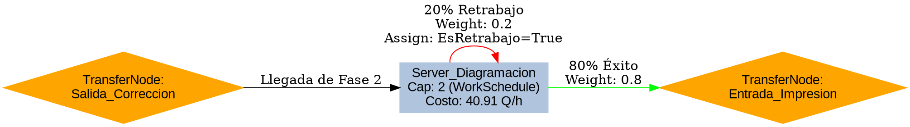

Entendido, aquí tienes la guía técnica definitiva de la **Fase 3: Diagramación y Diseño** con todas las configuraciones integradas (horarios, costos y lógica de ruteo) para que la consultes después.

---

###📝 Resumen Técnico: Fase 3 - Diagramación y Diseño####1. Definiciones de Estado (Entidad: Manuscrito)Para controlar el flujo y los tiempos variables, asegúrate de tener este estado:

* **`Manuscrito.EsRetrabajoDiseno`**: Booleano. Se usa para identificar si la entidad ya pasó por diseño y está regresando por una corrección.

---

####2. Configuración del Servidor: `Server_Diagramacion`Este objeto centraliza el trabajo de los **2 diseñadores** asignados.

**A. Capacidad y Horarios (WorkSchedule)**

* **Capacity Type:** `WorkSchedule`.
* **Initial Work Schedule:** `StandardWeek`.
* **Configuración en pestaña Data:**
* 
**Días:** Lunes a Viernes.

* 
**Turnos:** 07:00-12:00 y 13:00-15:00 (Total 7 horas laborables).

* 
**Value (Capacidad):** **2** (Representa a los dos diseñadores disponibles simultáneamente).

**B. Tiempos de Procesamiento (Processing Time)**
Debes sumar los tiempos de portada y diagramación para la primera pasada, y usar el tiempo de retrabajo para las siguientes.

* 
**Expresión:** `Math.If(Manuscrito.EsRetrabajoDiseno, Random.Uniform(1, 3), Random.Uniform(1, 4) + Random.Uniform(2, 5))`.

* 
**Units:** `Days`.

**C. Finanzas (Financials)**
Configura el costo del recurso humano según la Tabla 1:

* 
**Idle Cost Rate:** `40.91` Q/h.

* 
**Usage Cost Rate:** `40.91` Q/h.

---

####3. Estructura de Nodos y Ruteo (Grafo de Fase 3)Esta fase recibe entidades de la Fase 2 y las envía a la Fase 4 o de vuelta al servidor según la probabilidad de error.

---

####4. Detalles de la Lógica de Control* 
**Decisión de Retrabajo:** Al salir del `Server_Diagramacion`, el sistema evalúa la probabilidad del **20%** definida en la Tabla 4.

* **Asignación en el Loop:** Es fundamental que en el *Path* de regreso (o en el *State Assignment* del nodo de salida) pongas `Manuscrito.EsRetrabajoDiseno = True`. Esto garantiza que, al reingresar, el diseñador solo tarde de **1 a 3 días** en lugar de volver a hacer todo el proceso de portada y diagramación.

* **Regla Off-Shift:** Como usas un `WorkSchedule`, asegúrate de que la propiedad **Off-shift Rule** esté en `Suspend` para que el diseñador continúe el trabajo exactamente donde lo dejó al día siguiente.

Con esta configuración, tu modelo reflejará exactamente la capacidad limitada de los 2 diseñadores, sus horarios laborales de la USAC y los costos operativos por hora. ¿Listo para pasar a la **Fase 4 (Impresión)**?